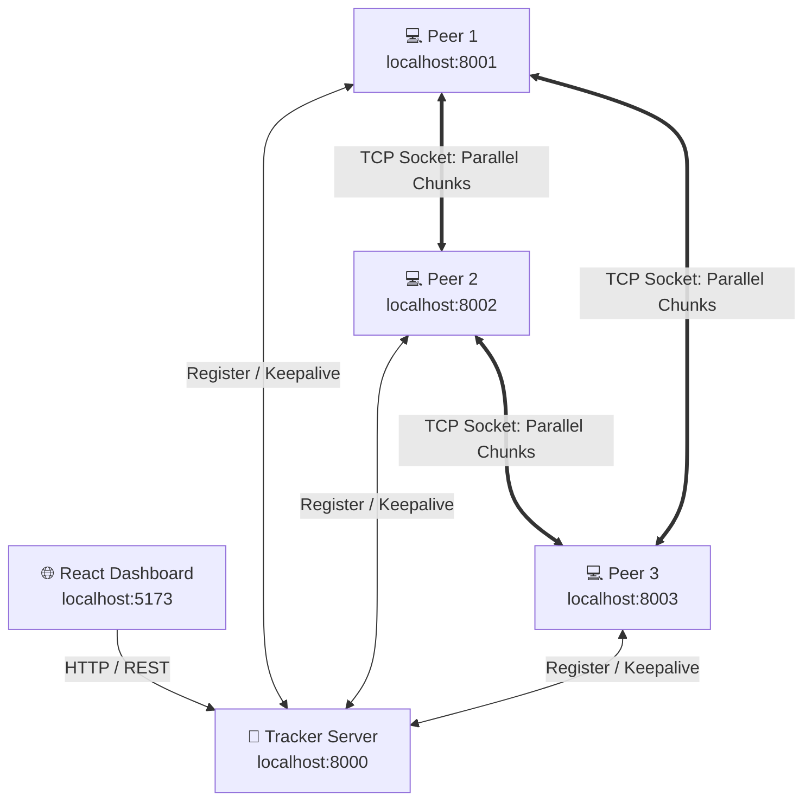

<div align="center">

# ⚡ Peer2Peer — Distributed File Sharing Network

  <p align="center">
    <strong>A BitTorrent-inspired Peer-to-Peer (P2P) File Sharing System with Multi-Seeder Parallel Downloads, SHA-256 Verification, and Real-Time Dashboard.</strong>
  </p>

  <p align="center">
    
    
    
    
    
  </p>

</div>

---

## 🌟 Overview

**Peer2Peer** is a lightweight, high-performance distributed file-sharing engine designed to demonstrate fundamental computer networking and distributed systems principles. Built from scratch without third-party P2P frameworks, it simulates real-world BitTorrent mechanics including **Tracker coordination**, **file chunking**, **SHA-256 hash validation**, **multi-peer parallel downloads**, and a **real-time React management dashboard**.

---

## ✨ Key Features

| Feature | Description |
| :--- | :--- |
| 🗂️ **Fixed-Chunk File Splitting** | Files are split into fixed 512KB chunks for non-blocking streamable transfers. |
| ⚡ **Multi-Seeder Parallel Download** | Simultaneously fetches non-overlapping chunks from multiple peer nodes in parallel. |
| 🔒 **SHA-256 Chunk Verification** | Cryptographic verification ensures absolute data integrity per chunk before assembly. |
| 📡 **Centralized Tracker Server** | High-performance FastAPI backend coordinating peer availability and file registries without carrying file payloads. |
| ⏯️ **Pause & Resume Downloads** | Persistent state tracker allows seamless resumption of incomplete chunk downloads. |
| 📊 **Real-time Web Dashboard** | Sleek React + Vite interface displaying peer swarms, transfer metrics, file explorers, and live progress bars. |

---

## 🏗️ System Architecture



### 🔄 How It Works
1. **Peer Registration:** Peer nodes start up, scan their local `shared_files/` directory, and register their available file hashes with the **Tracker Server**.
2. **File Discovery:** A requesting peer queries the Tracker for a file. The Tracker returns the swarm metadata and a list of active peers holding specific chunks.
3. **Parallel Chunk Transfer:** The peer establishes direct TCP socket connections to multiple seeders at once, pulling different chunks concurrently.
4. **Integrity & Reassembly:** Each downloaded chunk is verified against its SHA-256 hash. Once all chunks pass validation, they are concatenated into the original file.

---

## 📁 Repository Structure

```
peer2peer/
├── 📡 tracker/             # FastAPI Tracker Coordination Server
│   ├── main.py            # Entry point for Tracker application
│   ├── routes/            # Tracker REST endpoints (register, list, search)
│   ├── services/          # Business logic for peer registry & file mappings
│   └── storage/           # In-memory peer database & file index
├── 💻 peer/                # Peer Node Client & Socket Server
│   ├── main.py            # Entry point for launching Peer instances
│   ├── client.py          # Socket client for requesting & downloading chunks
│   ├── server.py          # Socket server for seeding chunks to other peers
│   ├── parallel_downloader.py  # Multi-threaded concurrent chunk fetcher
│   └── config.py          # Peer network configuration dataclass
├── 🧩 chunk_manager/       # File splitting and reassembly engine
├── 🔐 hash_manager/        # SHA-256 cryptographic calculation utilities
├── ⏯️ resume_manager/      # State persistence for chunk resumption
├── 📊 dashboard/           # React + Vite Web UI
│   ├── src/components/    # Swarm visualizer, Peer list, Upload section
│   └── src/services/      # API integration client
└── 🧪 tests/               # Pytest suite covering all modules
```

---

## 🚀 Quick Start Guide

### 1️⃣ Clone the Repository & Setup Environment

```bash
# Clone the repository
git clone https://github.com/mishashettyy11/Peer2Peer.git
cd Peer2Peer

# Create & activate virtual environment
python -m venv venv
# On Windows:
.\venv\Scripts\activate
# On Mac/Linux:
source venv/bin/activate

# Install dependencies
pip install -r requirements.txt
```

---

### 2️⃣ Start the Tracker Server

```bash
uvicorn tracker.main:app --reload --port 8000
```
> The Tracker will start on `http://127.0.0.1:8000`.

---

### 3️⃣ Start Peer Nodes

Open separate terminal windows to launch distinct peer instances:

**Terminal 2 (Peer 1):**
```bash
python -m peer.main --port 8001 --peer-id peer_1 --shared-dir shared_files
```

**Terminal 3 (Peer 2):**
```bash
python -m peer.main --port 8002 --peer-id peer_2 --shared-dir shared_files_2
```

---

### 4️⃣ Launch the Web Dashboard

```bash
cd dashboard
npm install
npm run dev
```
> Open your browser at `http://localhost:5173` to monitor live swarm activity, inspect peers, and trigger downloads!

---

## 🧪 Running Automated Tests

Run the full pytest suite to verify tracker routing, chunking, parallel downloads, and hash validation:

```bash
pytest tests/
```

---

## 🎓 Core Computer Science Concepts Demonstrated

* **Distributed Systems:** Decentralized data transfer, peer discovery, swarm coordination.
* **Network Protocols:** Custom TCP socket messaging, framing, and HTTP REST APIs.
* **Concurrency:** Thread pools and async I/O for non-blocking multi-peer downloads.
* **Data Security & Integrity:** Cryptographic SHA-256 checksums per file chunk.

---

## 📜 License

Distributed under the **MIT License**. See `LICENSE` for details.

<div align="center">
  <sub>Built with ❤️ by <a href="https://github.com/mishashettyy11">mishashettyy11</a></sub>
</div>
